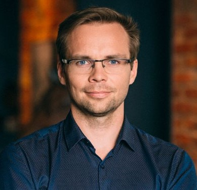

---
layout: frontpage
---

 

# Koolituse lühikirjeldus

Tegemist on statistikute lemmiktarkvara R-i koolitusega, kus saame ülevaate R keele peamistest konstruktsioonidest ja andmetüüpidest, andmetöötlusvõimalustest, hõlpsast jooniste tegemisest paketi `ggplot2` vahenditega ja kiikame R Shiny interaktiivseid raporteid.

## Koolituse ülesehitus

Koolitusprogramm koosneb kahest õppepäevast ja koduülesannetest. Õppepäevad toimuvad **2. ja 23. septembril 10-16 TÜ Delta õppehoones aud. 2030**. Vt. täpset ajakava all.

Teemadele läheneme praktiliselt, _hands-on_	 põhimõttega - käsitletav teema on kokkuvõtlikult esitatud koolituse materjalides, teemat saadavad praktilised näited, mis teeme läbi kõigile nähtaval ekraanil ja lahendame lühikesi ülesandeid. Lahendamisel tekkinud probleemid lahendame kohapeal ja koos. Edasiste oskuste arendamiseks saab kasutada [lisamaterjale](lisamaterjal) (enamasti küll ingliskeelsed).

Koolituse läbinud osaleja:

* tunneb R keele süntaksit ja andmetüüpe,
* oskab andmeid sisse lugeda, töödelda ja salvestada,
* oskab kasutada kirjeldava statistika meetodeid,
* oskab visualiseerida andmeid ja seoseid tunnuste vahel,
* koostada algelise interaktiivse raporti.

## Ajakava ja sisu 

|		| Kolmapäev, 2. september  |
|---:	| ---	|
| 9:45  | Kogunemine  |
|10:00  | Avasõnad, sissejuhatus  |
|10:15  |**Esimene sessioon**   * R ja RStudio tutvustamine  	* Ülevaade statistikakeelest R |
|12:00 	|Lõunapaus (Delta kohvikus)	|
|12:45	|**Teine sessioon**   * Töötamine erinevate andmetüüpidega   * Andmete importimine ja eksportimine	|
|14:15	|Kohvipaus (Delta kohvikus)	|
|14:30	|**Kolmas sessioon**   * Andmestiku teisendused |
|16:00	|Päeva kokkuvõte, kodutöö tutvustus	|

**Kodus**

I kodutöö (andmestiku import, R-i abivahendite kasutamine, andmestikust esmase ülevaate koostamine, andmetüüpide muutmine, esmatasandil arvutamine)

|		| Kolmapäev, 23. september  |
|---:	| ---	|
| 9:45  | Kogunemine  |
|10:00  | Avasõnad, sissejuhatus  |
|10:15  |**Neljas sessioon**   * Eelmiste teemade kordamine, kodutöödel tekkinud probleemide käsitlemine  	* Joonised R-is |
|12:00 	|Lõunapaus (Delta kohvikus)	|
|12:45	|**Viies sessioon**   * Joonised R-is   * R Shiny |
|14:15	|Kohvipaus (Delta kohvikus)	|
|14:30	|**Kuues sessioon**   * Jätkub: R Shiny |
|16:00	|Päeva kokkuvõte, kodutöö tutvustus	|

**Kodus** 

II kodutöö (jooniste tegemine ja viimistlemine, R-i rakenduse koostamine)

# Koolitaja

Kaur Lumiste kaur.lumiste [at] ut.ee ja TÜ Delta õppehoones kab. 4079.
